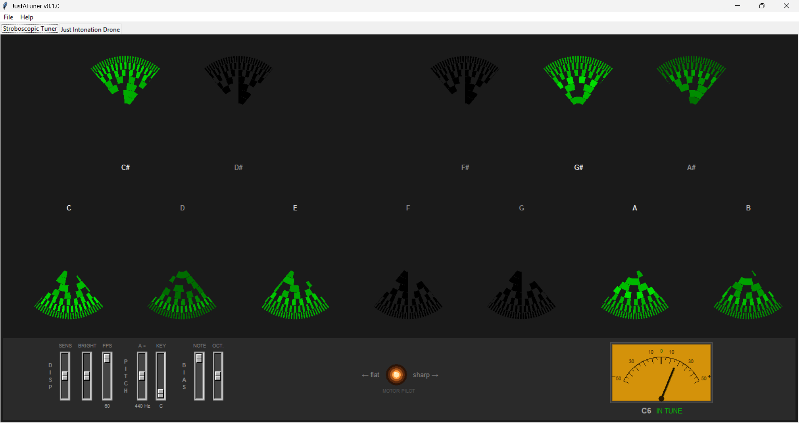
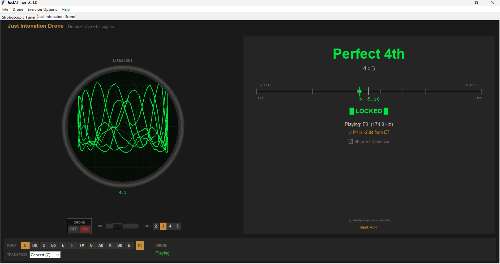

# JustATuner

A free cross-platform desktop tuner for musicians by [Matt Stohrer](https://www.StohrerMusic.com). Two tools in one window: a 12-wheel chromatic stroboscopic tuner for everyday tuning and intonation work, and a just-intonation drone with live interval analysis and a vintage Lissajous CRT for ear training against true ratios.

> **Heads-up for first install**: Windows shows a SmartScreen warning, macOS blocks the app as "unidentified developer," and Linux may need one extra package. None of it is broken — see **[Installation](#installation)** at the bottom for the one-time unblock step on your platform.

## Features

### Stroboscopic Tuner



A 12-wheel stroboscopic chromatic tuner. Each pitch class gets its own wheel; play a note and the wheel for that note stands still, drifting right when you're sharp and left when you're flat. The faster the drift, the further out of tune. Locked = perfectly in tune.

- 12 chromatic wheels, each with seven concentric rings — one ring per octave, lit by real spectral data so the played octave reads sharp and bright while the rest sit dim
- GPU-accelerated rendering via Rust/wgpu when the optional extension is built — 60-120 fps on capable machines, with an automatic fallback to canvas rendering everywhere else
- Per-pitch-class phase tracking with temporal smoothing
- Vintage backlit VU meter showing the closest pitch class and cents off
- Configurable reference pitch (A=440, 441, 442, etc.) and transposition (Concert, B♭, E♭, F)
- Per-wheel cents bias for instruments with systematic intonation quirks; per-ring bias for octave drift
- Configurable frame rate, stripe color, and faceplate color
- A quality microphone is recommended (laptop mics work but you'll see room noise lighting wheels you didn't play)

### Just Intonation Drone



A drone synthesizer with live just-intonation interval analysis. Set a root, flip the DRONE switch on, and play notes against it; the meter shows you the JI interval you're hitting (Perfect 5th, Major 3rd, etc.) and how close you are to the perfect whole-number ratio. The round green Lissajous CRT visualizes the interference between your note and the drone — a stable shape means the ratio is locked.

- Root note selector across all 12 chromatic pitches, with a dice button for random root practice
- DRONE switch with vintage labeled OFF / ON positions
- Drone voicings: root, root + fifth, major triad, minor triad
- Drone sound: pure sine or rich harmonic stack
- Octave selector (2-5) for the drone fundamental
- Interval meter with LOCKED indicator (within 5¢ of just intonation) and cents readout
- Lissajous oscilloscope with configurable phosphor color (green, amber, blue, white), trace thickness, trail count, and resolution
- Show ET Difference toggle — see how far each JI interval sits from equal temperament
- Transposition support (Concert, B♭, E♭, F) so written-pitch instruments see their own note names
- Instrument presets for pitch detection (sax family, voice, brass, strings, etc.)
- Spectral notch filter on the mic input at every drone oscillator frequency — knocks down direct bleed so the pitch detector can lock onto you instead of the drone. It helps but it's not magic: room reflections, the drone's higher harmonics, and any speaker feedback at slightly-shifted frequencies still get through. **Headphones strongly recommended when the drone is on** — open speakers feed the drone back into the mic in ways the notch can't fully cancel.

### General
- Two tabs, one window — only the active tab uses the microphone, so the OS never sees two opens on your mic
- Last-active tab restored on launch
- In-app User Guide (Help > User Guide)
- Window opens maximized; resize freely from there
- Cross-platform: Windows, macOS, Linux
- Settings persist between sessions in a platform-appropriate config directory

## Installation

### From Release (Recommended)
Download the latest build for your platform from the [Releases](https://github.com/stohrermusic/justatuner/releases) page.

### Windows

Run `JustATuner-Windows-Setup-X.Y.Z.exe`. The installer places the app under Program Files and adds a Start Menu shortcut (and optionally a Desktop shortcut).

The app isn't code-signed yet, so Windows SmartScreen may show a blue **"Windows protected your PC"** dialog on first launch. To proceed:

1. Click **More info** on the SmartScreen dialog.
2. Click the **Run anyway** button that appears.
3. Approve the UAC prompt when Windows asks for admin rights to install.

You only need to do this once. After install, the Start Menu / Desktop shortcut launches the app normally.

### macOS

**Apple Silicon only** (M1 / M2 / M3 / M4). The macOS build ships as an arm64 binary. There's no Intel Mac build because the `sounddevice` Python package (which talks to the OS audio system) doesn't bundle PortAudio reliably on Intel macOS, and an audio app where the audio doesn't work isn't worth shipping. Intel Mac users can still run JustATuner from source after `brew install portaudio` — see "From Source" below.

Apple charges developers $100 a year to sign apps, which I am not paying for a free giveaway. macOS will block the unsigned app on first launch with either an **"unidentified developer"** warning or a **"JustATuner.app is damaged and can't be opened"** error. To unblock it:

1. Double-click the downloaded `JustATuner-macOS.zip` to unzip it.
2. Drag `JustATuner.app` into your **Applications** folder.
3. Open **Terminal** (in `/Applications/Utilities/`) and paste this one command:
   ```
   xattr -cr /Applications/JustATuner.app
   ```
4. Open the app normally. You only need to do this once.

This strips the quarantine flag macOS adds to downloaded files, which is what triggers both warnings. The same command works on every macOS version.

### Linux

The audio engines depend on PortAudio. Install it with:

```
sudo apt install libportaudio2
```

(or the equivalent package on your distro: `portaudio` on Arch, `portaudio-devel` on Fedora.)

The downloaded binary may not have the executable bit set after download — fix it once with:

```
chmod +x JustATuner-Linux
./JustATuner-Linux
```

### From Source

```bash
git clone https://github.com/stohrermusic/justatuner.git
cd justatuner
pip install -r requirements.txt
python main.py
```

Python 3.11+ recommended.

## Building

```bash
# Build for current platform (Win/Linux: single binary; macOS: .app bundle)
python build.py

# Clean and rebuild
python build.py --clean
```

Each platform has to build its own binary — there's no cross-compilation. The GitHub Actions workflow in `.github/workflows/build.yml` does all three (Windows installer, macOS .app, Linux binary) on every push to `main`.

## Config Location

Settings persist between sessions in:

- **Windows**: `%APPDATA%\JustATuner\`
- **macOS**: `~/Library/Application Support/JustATuner/`
- **Linux**: `$XDG_CONFIG_HOME/JustATuner/` (or `~/.config/JustATuner/`)

## Credits

The stroboscopic tuner side is extracted from [Stohrer Sax Shop Companion][ssc], which has been keeping it sharp in real saxophone repair shops for the better part of a year. The just-intonation drone side is the original [JustATone][jat] Python prototype, preserved here after that project pivoted to a Rust/bevy audio-reactive garden visualizer.

## Questions or Feedback

Email: stohrermusic@gmail.com

[ssc]: https://github.com/stohrermusic/Stohrer-Sax-Shop-Companion
[jat]: https://github.com/stohrermusic/justatone
